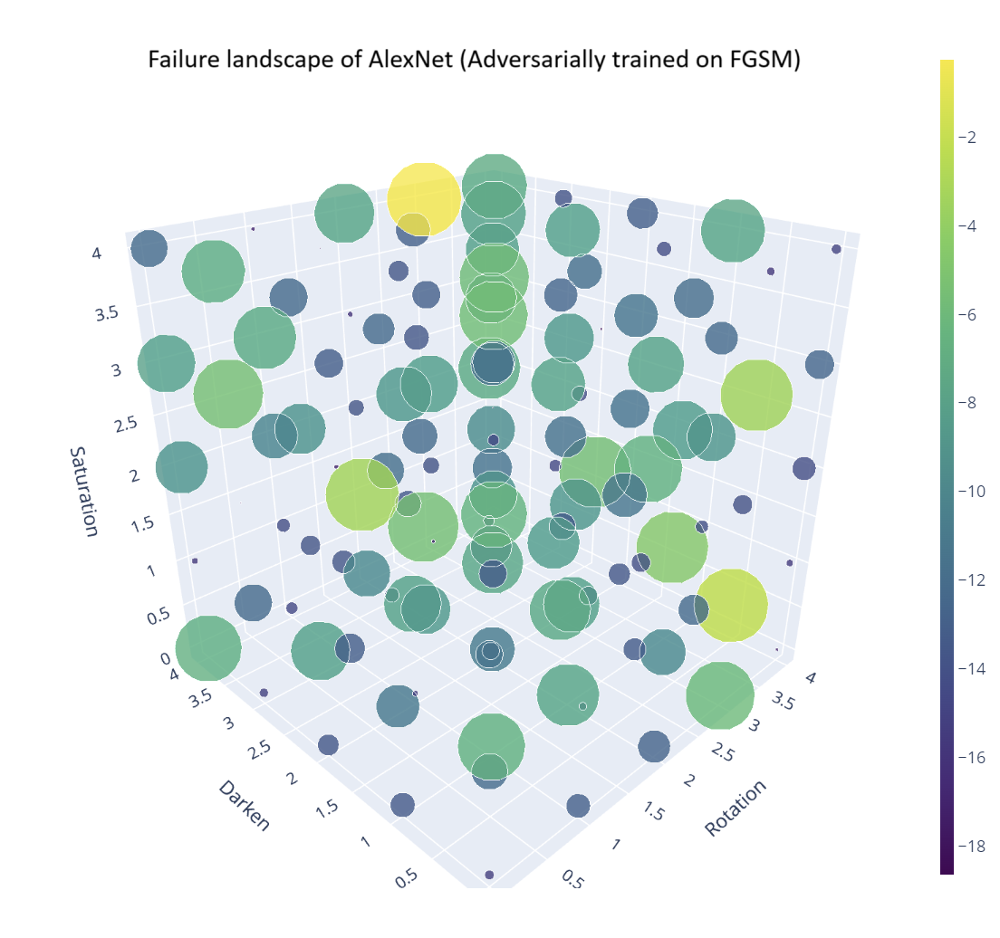
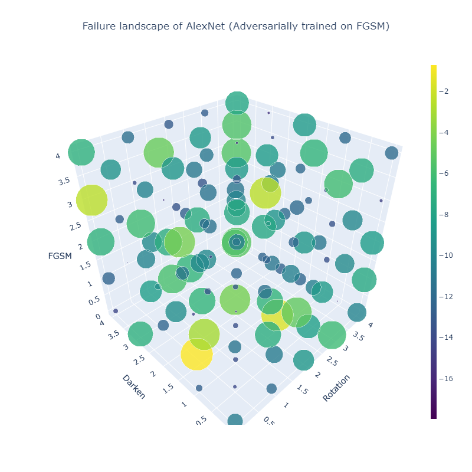

### Q1. How does one specify the search-space constraints C? For instance, in an image setting, it is not clear to me how to define abstract concepts.
If we think about any audit process, whether it is in AI or not, we typically have to start with some constraints (or what we call as concepts) C. Given the infinite number of possible constraints, domain knowledge is important for narrowing down the search space and specifying constraints. As any method has assumptions and constraints, we aim to pragmatically balance narrowing down the search space while automating the process as much as possible. Before testing any model, users must know why they need to test the model. If we approach the problem from the application's perspective, constraints often emerge organically, though the complexity of specifying these constraints can vary:
1. Striaghtworfard specifications: Consider the task of detecting airplanes on ground at an airport from a surveillance aircraft flying above. The engineers' objective is to identify the physical conditions under which the model fails to detect planes. Potential constraints may include environmental factors such as darkness levels and physical conditions such as the angle of observation (i.e., image rotation). Specifying constraints in such scenarios is relatively straightforward, involving operations such as changing darkness or rotation.
2. Abstract specifications: In scenarios such as image generation, specifications can be more abstract. For example, a legislative body might wish to assess how a model such as Stable Diffusion exhibits social bias in order to comply with anti-discriminatory laws. Here, constraints go beyond mere physical transformations to include defining conceptual attributes. To identify constraints that lead to societal bias—captured either through limited human feedback (eq. 8) or AI feedback (eq. 9)—it is necessary to consider factors associated with bias. For instance, gender imbalance in professions (whereby most doctors and CEOs are male) suggests that profession itself becomes a constraint. Just as financial accounting auditors are adept at identifying where financial breaches occur, and police inspectors are skilled in spotting common signs of criminal activity, future AI auditors will hopefully possess a keen understanding of the common gateways and constraints related to AI failures.

In the long run, it might be possible to transfer knowledge from one testing case to the other (e.g., X are the common constraints for Y kinds of tasks in Z kind of models ) or even search for constraints.

### Q2. How does one choose the reward function R without ad-hoc human feedback? I do not see how the approach could identify regions of failure without a pre-constructed data set, for which an adaptive search would be impossible.
example, we did not rely on human feedback to learn a reward at the end.

Please note that the paper mentions two types of human feedback: 
1) relatively inexpensive human feedback, involving 1-4 human inputs, utilized to mitigate failures in all experiments, as outlined in the failure summary report discussed in Section 3, and 2) human feedback to learn a reward, as explored in Section 2.3.3. 
It is important to mention that the latter is employed in only a portion of one experiment (Section 2.3.3), whereas other experiments do not depend on human feedback for constructing the reward "R." Believing that the question is about this reward from human feedback, we employ three pragmatic strategies: 
1) leverage domain knowledge wherever possible, as in image classification (section 2.3.1) and text summarization (section 2.3.2); 
2) solicit human feedback if measurements need to be abstract, such as in image generation with human feedback (section 2.3.3); and 
3) rely on AI feedback when human input is prohibitively expensive, as in image generation with AI feedback (section 2.3.3).

We have template datasets (refer to Appendix D and C) which are modified by the RL algorithm to find failure modes. Therefore, search is possible.

Identifying potential failures presents a significant challenge due to the vastness of the space, and researchers are still in the early stages of formulating solutions. In our case, the constraints/concepts “C” (discussed in Q1) outline how to specify the search space for failures to achieve our objectives, while the reward "R" measures failures. We will clarify this in the paper. 

### Q3. The work uses CLIP embeddings to construct a reward function for image data. Did you observe "double failures", i.e., a failure of the reward function to identify failures of the analyzed functions?
Our analysis did not specifically uncover instances where the reward function was based on CLIP embeddings. As shown in Figure 29, the action distribution obtained from the human feedback is similar to that of CLIP embeddings (Wasserstein distance of 0.0011). The blue and orange plots are human and CLIP, respectively (apologize for the incorrect legend).

### Q4. How much human interaction is necessary to find a good amount of failure cases?
Reminding the answer to Q2, we mention two types of human interactions in the paper:
1) In all experiments we only needed between 1 to 4 human interactions for failure mitigation 
2) To learn the reward function in section 2.3.2, “1000 instances of human feedback were collected over all 100 episodes” (line xxx of the paper). Considering the abstractness of the measurement (e.g., quality and social bias), we believe it is efficient. 

We would like to reiterate that human feedback for learning rewards is only needed when the measurements are extremely abstract and we only needed that for one of our experiments. 

### Q5. How effective is the fine-tuning? I can imagine that a large region of failure cases might require a substantial adaptation of the model, which is tricky to fine-tune without catastrophic forgetting. Your proposed last-layer fine-tuning may not be sufficient in this case. Maybe it would be useful to interface with existing approaches.

For classification models, we used final layer fine-tuning and for stable diffusion we used LoRA:

Last layer fine-tuning: When fine-tuning protocol, we apply the action derived from the fine-tuning process to the data only 50% of the time (apologize for not specifying this properly). This approach is designed to balance the introduction of new learning with the retention of previously acquired knowledge. By not applying the fine-tuning action universally across all data, we reduce the risk of the model completely "forgetting" its earlier learning due to the overpowering influence of the new data or adjustments.
LoRA-style fine-tuning: As mentioned in Appendix E.3, we required only 4 iterations.
Since adaptive learning rates are used in Adam and other SGD techniques, a little bit of over-training (over fine-tuning in this case) does not cause problems.

### Q6. Adversarial training may already mitigate some failure cases. Have you analyzed how much of the failure cases could already be mitigated through adversarial training?
The better the ML model is trained, the easier it is for our RL algorithm to find failures as the RL algorithm receives clean and less confusing rewards from such models. Therefore, an adversarially trained ML model is a blessing.

Following the reviewer’s suggestions, we have added an experiment to implement adversarial training, utilizing Fast Gradient Sign Method (FGSM) samples to enhance the model's resilience. However, consistent with our prior observations, we identified vulnerabilities within the adversarially trained model. This led us to an essential hypothesis: it is crucial to initiate with a “summarize phase,” which aims to delineate all potential failure modes before undertaking the reconstruction of the model's decision boundary to enhance robustness.

  
   
  <em>Figure 1: Failure landscape of AlexNet (Adversarially trained on FGSM) with rotation, darkening and saturation actions.</em>

Our analysis revealed that while adversarial training techniques like FGSM enhance model robustness, they primarily do so by altering samples close to the decision boundary. This phenomenon is evident from the provided graph, where points near the original image coordinate (0, 0, 0) exhibit greater resilience to failure compared to those positioned further away. Despite the relative safety of nearby perturbations, we discovered that the model remains susceptible to failures at more distant points, as exemplified by the instance marked with a yellow circle at the coordinate (3, 4, 4).

  
   
  <em>Figure 2: Failure landscape of AlexNet (Adversarially trained on FGSM) with rotation, darkening and FGSM actions.</em>

Even when model is trained on adversarial samples and tested against the same adversarial attack we notice even though the models becomes more resilient to the adversarial samples there might be more samples which the model is more likely to fail (as shown in this graph) at which furthers our hypothesis that a summarize step is needed before reconstruction of the decision boundary.

### Q7. Is there some way you can categorize the observed failure cases?

Failures are already classified on the bases of action space as seen in Fig 2 of the paper. Please refer to the Appendix ?? to see additional failure modes on different models. Also, each mode clearly defines a distinct mean and standard deviation. This categorization based on action space helps with making further actions in the downstream applications (e.g., legislative bodies or engineers). 

