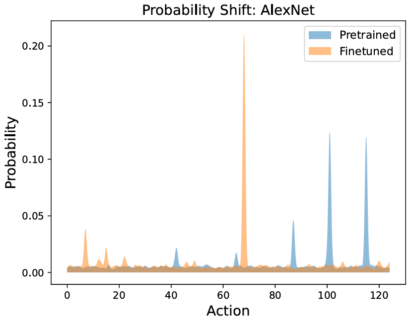
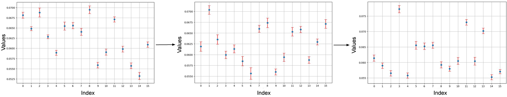

## Q1. Following up from the weaknesses outlined above, what will happen if the model has two or more failure modes that need to be removed simultaneously? I am wondering if I will end up having to play whack-a-mole with the failures…

Failure mitigation based on human feedback indeed helps even more when we have multiple failure modes compared to fine-tuning without human judgments. By merely using data from multiple failure modes in the fine-tuning stage removes all targeted failures simultaneously.

While it is true that we are not able to formally guarantee that the next failure mode that pops up is less important, the sum of **probabilities of the next failure mode is generally lower**. Empirically, we have not seen instances where mitigating one failure mode inadvertently exacerbates another (Refer fig 24 in appendix). Conceptually, if it was the case, the RL algorithm would have been able to pick up such failures earlier. The way we fine-tune, described in the answer for Q2, also plays an important role in making sure new failure modes do not appear. 

If the new failure mode is important, we can fine-tune again. Being able to **iteratively remove these failure modes**, based on human judgment and expertise, is an advantage of our framework. In our experiments, we were able to remove failure modes in 1-4 human feedback iterations. In Figure 10 Alexnet, the pretrained had two failure modes but fin- tuning on the sample chosen by a human reduced both failure modes.

  
   
  <em>Figure 1: Probability distribution of actions for AlexNet (Double failure observed)</em>

  
   
  <em>Figure 2: Iterative probability shifts while finetuning in T5 model</em>

## Q2. Have you explored alternative ways to deal with catastrophic forgetting when fine-tuning?

As part of our fine-tuning protocol, we apply the action derived from the fine-tuning process to the **data only 50% of the time**. This approach is designed to balance the introduction of new learning with the retention of previously acquired knowledge. By not applying the fine-tuning action universally across all data, we reduce the risk of the model completely "forgetting" its earlier learning due to the overpowering influence of the new data or adjustments. For a detailed explanation of this technique and its underlying rationale for other parameters used while fine-tuning please refer Section 4, where we elaborate on the experimental setup and the specific parameters used.

This work has further inspired us to develop methods for controllable fine-tuning. Although it presents a challenging task, in a separate research effort beyond the scope of this paper, we have achieved limited success in developing controllable fine-tuning to object detection. However, we have yet to develop a universal method applicable to any model
