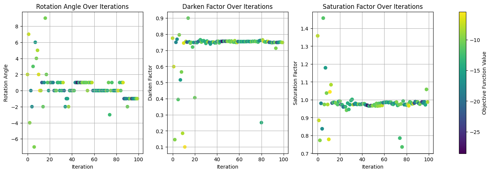
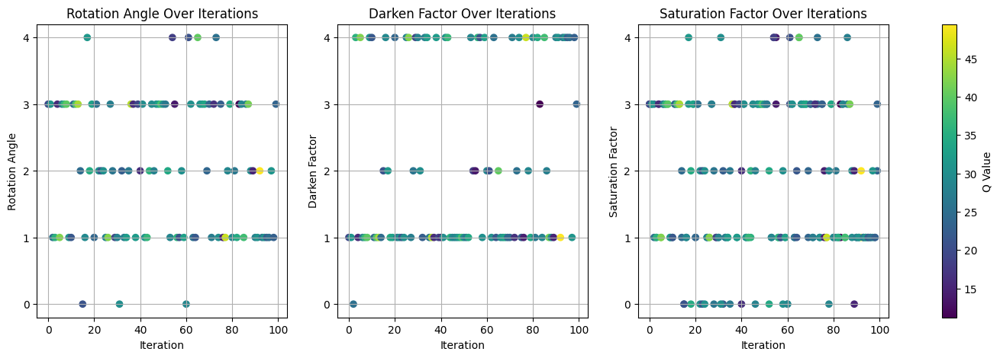
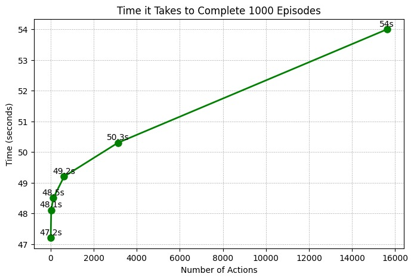

## Q1. I have a question about how the stated goal of looking for failure modes maps on to a reinforcement learning task. In particular, don't the Q values learned estimate the expected value of future reward, and thus reflect some structure in how the concept space is traversed? In other words, isn't it the case that a high Q value could reflect a state action pair which is likely to lead to a future state action pair which will result in failure, but may not result in failure itself.

The reviewer is correct in highlighting that a high Q value indicates high future reward. However, it is important to clarify that **high Q values do not necessarily gurantee a trajectory towards failure** – whether immediate or delayed. When we take an action (e.g., rotate by x, then darken y, and then saturate by z) with a stochastic policy, the Q values merely indicate that "if you take this action, you **might** reach a failure."

## Q2. It would be very interesting to compare the failure modes found by the method presented with other ways of attempting to address the problem of model reliability across the search space, such as uncertainty estimation. Concretely, if we consider samples detected with this method as part of a failure mode, what kind of uncertainty estimates would be generated by (for example) a deep ensemble on that same sample?

We would consider having a deep ensemble as complementary to our method (will be **expensive** though) rather than a different way to achieve the same objective of finding failures. Any technique that can estimate the epistemic uncertainty (e.g., ensembles, SVI, MCMC, MC dropout, conformal prediction) tells us how unsure it is about its predictions due to lack of knowledge. Therefore, test data points that are far away from training data have a higher uncertainty. After estimating the epistemic uncertainty, we still need a way to sample these highly uncertain areas. If we use this epistemic uncertainty in RL-based sampling, assuming the model is well-calibrated, it will help with speeding up our exploration as it narrows down the search space. Nevertheless, **due to lack of concrete work on** estimating (or at least defining) **epistemic uncertainty of generative LLMs and VLMs** that we consider, extending current work to include epistemic uncertainty in RL search would require significant amount of work, which we would love to explore in the future. Since RL is a non-myopic planner (i.e., considers many steps of future rewards), we still do not have a very clear idea how to incorporate epistemic uncertainty for long horizon planning. Having said that, we included a **new experiment with Bayesian Optimization** (BO)---a myopic planner. 

We attempted to use BayesOPT for our analysis, but encountered issues due to deprecated code. Consequently, we used vanilla BO. The acquisition function was "gp_hedge," which probabilistically chooses one of the following acquisition functions at every iteration: lower confidence bound, negative expected improvement, or negative probability of improvement. During this process, we identified several concerns related to BO. One significant issue is its tendency to get trapped in local minima. Without specific modifications, BO struggles with disjoint boundaries or discrete action spaces common in NLP tasks. In contrast, RL methods, which are inherently designed to promote long-horizon exploration, offers a strategic advantage in such contexts.
<!-- Image : Figure 1-->
<!-- 
*Figure 1: Illustration of Bayesian Optimization's tendency to get trapped in local minima, highlighting its exploration limitations.* -->

  
   
  <em>Figure 1: Illustration of Bayesian Optimization's tendency to get trapped in local minima, highlighting its exploration limitations.</em>

<!-- Image : Figure 2 -->
<!-- 
*Figure 2: Depiction of reinforcement learning's effective exploration of the parameter space, demonstrating its robustness.* -->

  
   
  <em>Figure 2: Depiction of reinforcement learning's effective exploration of the parameter space, demonstrating its robustness.</em>

We also **implemented a deep ensemble** for the AlexNet and fed in sample from the failure modes. Yes, samples from failure models reported high variance in deep ensembles. Note that the converse is not true---the deep ensemble would provide a high predictive variance even for regions that never fails, if the ensemble has never seen data in that region.

## Q3. In general, it seems like the success of this method would depend significantly upon the exploration technique (Macroscopic and Microscopic exploration). Can you provide more details about how the exploration phases were decided, as well as a discussion of other exploration techniques which could be considered? 

We use **both** macroscopic and microscopic exploration (Figure 1 "Discover"). In a general setting, we start with macroscopic exploration as broad-brush strategy to swiftly identify regions that are more prone to failures. It then jumps to microscopic exploration phase for a more nuanced analysis. If a legislative body or an engineer wants to explore any area in detail, it is possible to start microscopic exploration from any action point in the space .

We have reported some exploration strategies in Table 1 of the paper. As for other ways to improve exploration, 
1. incorporating domain knowledge into RL exploration (e.g., Since we know the gender bias has some association with profession, pay more attention to it.)
2. transferring the knowledge from one model to the other (e.g., We observed most fully connected networks are less robust to image rotation. Therefore, always test rotation failures whenever we have similar architectures.)

## Q4. Do you sample the entire training dataset in your experiments? How many steps do you consider per episode? Do you have to run one episode for each datapoint in the training set? How is the failure landscape visualized/how are failure modes curated for the example tasks shown? In general there need to be more details about the procedure and computational burden of the technique described for the experimental results shown.

We utilize only a specific **subset of the training dataset** for exploration and the number of steps per episode is adaptive, based on number of RL model's actions leading to failure, allowing us to tailor the exploration depth to the complexity of each scenario. Not every data point necessitates an individual episode.

Failure modes and visualizations: Unfortunately, we had to move them to the Appendix. Please refer to **Appendix Figs 19,20,21,22,23,24 for examples of failure landscape for each model**. We visualized failure landscape up to 3 different type of actions depending on the number we show it differently using a 2D or 3D interactive plot. 

Details on the **computation used are thoroughly outlined in the Appendix B**, highlighting the computational need for the experiment. None of the examples shown were heavily GPU or CPU dependent.

## Weakness 
**The proposed method is highly scalable**, thanks to deep RL's ability to handle high dimensional action spaces. In our study, we **intentionally started with a limited action space** to establish a strong foundational understanding and ensure the clarity. We have **conducted additional experiments** with up to **15,625 actions**. 

<!-- Image : Figure 3 -->
<!-- 
*Figure 3: Scalability assessment, demonstrating that computational time increases non-exponentially as the action space expands.* -->

  
   
  <em>Figure 3: Scalability assessment, demonstrating that computational time increases non-exponentially as the action space expands.</em>

The graph suggests that our method remains scalable as the action space grows exponentially.

We also appreciate the reviewer's suggestion to specify the scope of our work more clearly. The reviewer is correct in highlighting that our primary aim is indeed to define "actionable concept spaces" centered around perturbations of existing data samples as opposed to Zhao et al. 2018 and Ru et al. 2020. This focus allows us to systematically explore and identify failure modes within a controlled yet relevant range of scenarios, setting the stage for future work that may venture into a broader exploration of the input space.

Sagawa et al. 2019 and Hooker et al. 2019 are good references. Compared to these work that requires explicitly defining sub groups, our method is able to focus on abstract failures such as "image quality, bias, and artistic style" because of the human feedback. Our method offers an automated approach to perform the probing discussed by d'Amour et al., 2022.  **We will expand the literature review section.** 

Please refer to the Appendix section C for seeing the exact configuration for the models. 

We would also like to thank you for catching the typos.

